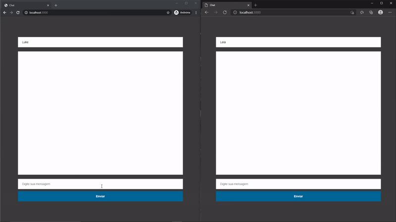

<h1 align="center">First Chat</h1>

<p align="center">
 <a href="#about-the-project">About the project</a> •
 <a href="#built-with">Built With</a> • 
 <a href="#getting-started">Getting Started</a> • 
 <a href="#usage">Usage</a> • 
 <a href="#author">Author</a>
</p>

<hr />

## Hi, everyone 👋

## 💻 About the Project

This is my first realtime chat project. I made it just to pratice and learn about websockets.

## 🚧 Built With

- [Nodejs](https://nodejs.org/)
- [Socket.io](https://socket.io/)
- [Jquery](https://jquery.com/)

## 📋 Getting Started

**Before start, in the project directory, you need run:**

- yarn

  ```sh
  yarn install
  ```

  or just run

  ```sh
  yarn
  ```

  To install all project dependencies.

**After that, you can run the available scripts:**

- Runs the app in the development mode using nodemon:

  ```sh
  yarn dev
  ```

  Open http://localhost:3000 to view the chat in the browser.
  The server will reload if you make edits.

  <br>

- Runs the app using node:

  ```sh
  yarn start
  ```

## 🚀 Usage

To see the magic of websockets, open [localhost](http://localhost:3000) in different browsers.

The result should look like this:



## 🐱‍👤 Author

**by: Vinicius Victor :)**

<a href="https://www.twitter.com/martnght/">
  
</a>
<a href="mailto:vinicius.victor.sm@gmail.com">
  
</a>
<a href="https://www.linkedin.com/in/vinicius-victor-6baa961a5">
  
</a>
